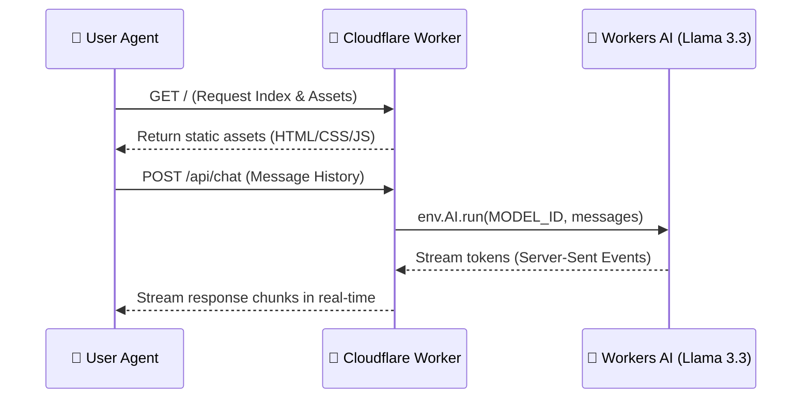

<div align="center">

# 🌅 monday

[](https://github.com/alchemist4real/monday)
[](LICENSE)
[](https://developers.cloudflare.com/workers-ai/)
[](https://www.typescriptlang.org/)

**monday** is a sleek, minimalist chat application running entirely on the edge, powered by **Cloudflare Workers AI** and **Meta Llama 3.3**.

[Live Demo](https://monday.alchemist4real.workers.dev) · [Report Bug](https://github.com/alchemist4real/monday/issues) · [Request Feature](https://github.com/alchemist4real/monday/issues)

</div>

---

## ⚡ Features

- **Edge-First Architecture**: Built on Cloudflare Workers for ultra-low latency globally.
- **Serverless LLM**: Powered by `@cf/meta/llama-3.3-70b-instruct-fp8-fast`.
- **Real-Time Streaming**: Native server-sent events (SSE) for fluid AI responses.
- **No Build Step Frontend**: Clean, responsive, modern vanilla CSS and JS served via Cloudflare Assets.
- **AI Gateway Ready**: Pre-configured support for caching and rate-limiting using Cloudflare AI Gateway.

---

## 🛠️ Tech Stack

- **Runtime**: [Cloudflare Workers](https://workers.cloudflare.com/)
- **LLM Engine**: [Cloudflare Workers AI](https://developers.cloudflare.com/workers-ai/)
- **Language**: [TypeScript](https://www.typescriptlang.org/) (Backend) & ES6 JavaScript (Frontend)
- **Tooling**: [Wrangler v4](https://developers.cloudflare.com/workers/wrangler/) & [Vitest](https://vitest.dev/)

---

## 📐 Architecture



---

## 🚀 Getting Started

### Prerequisites

Make sure you have [Node.js](https://nodejs.org/) installed and a [Cloudflare account](https://dash.cloudflare.com/).

### Installation

1. Clone the repository:
   ```bash
   git clone https://github.com/alchemist4real/monday.git
   cd monday
   ```

2. Install dependencies:
   ```bash
   npm install
   ```

3. Authenticate with Cloudflare:
   ```bash
   npx wrangler login
   ```

---

## 💻 Development & Deployment

### Run Locally

Start the local development server:
```bash
npm run dev
```
Open your browser at `http://localhost:8787` to chat with the local worker mock or live Workers AI.

### Running Tests

Validate functionality with Vitest:
```bash
npm test
```

### Type Checking & Validation

```bash
npm run check
```

### Deploy to production

Publish your app live to the edge:
```bash
npm run deploy
```

---

## ⚙️ Configuration

All bindings and worker settings are specified in `wrangler.jsonc`:

```jsonc
{
  "name": "monday",
  "main": "src/index.ts",
  "compatibility_date": "2025-04-01",
  "assets": {
    "binding": "ASSETS",
    "directory": "./public"
  },
  "ai": {
    "binding": "AI"
  }
}
```

To enable Cloudflare **AI Gateway** for analytics, caching, and rate limiting:
1. Open `src/index.ts`.
2. Uncomment the `gateway` block in `env.AI.run`:
```typescript
gateway: {
  id: "YOUR_GATEWAY_ID",
  skipCache: false,
  cacheTtl: 3600
}
```

---

## 📄 License

Distributed under the MIT License. See [LICENSE](LICENSE) for more information.
