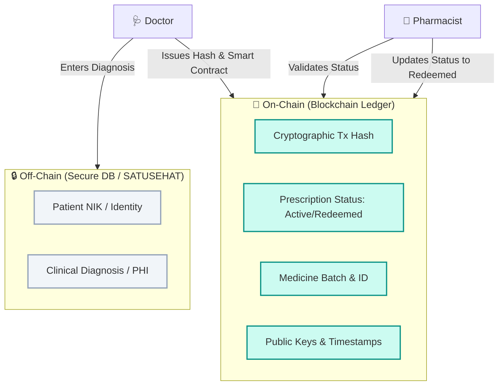

# 🛡️ PRISMA

**An innovative blockchain-powered antibiotic tracking and e-prescription system designed to prevent double-redeeming and combat antimicrobial resistance (AMR).**

[🌐 Live Simulator](https://prisma-rdk-simulator.vercel.app/) • [📖 Documentation](#-panduan-simulasi)

---

## ⚡ Overview

**PRISMA** (Platform Resep Interkoneksi Sistem Manajemen Antibiotik) is a decentralized health chain prototype engineered to solve the uncontrolled distribution of antibiotics in Indonesia. By integrating **blockchain immutability** and **smart contract validation** with the national **SATUSEHAT** health network, PRISMA prevents "double-spending" of digital prescriptions and secures the drug supply chain from production to patient dispensing.

---

## 🚨 The AMR Crisis in Indonesia

Antimicrobial Resistance (AMR) is one of the top global public health threats. In Indonesia, the threat is driven by:

*   **59% Resistance Rate:** E. coli resistance to third-line antibiotics (PAMKI, 2025).
*   **70% OTC Sales:** Pharmacies selling antibiotics without valid doctor prescriptions.
*   **Double-Redeeming Loophole:** Static paper or digital prescriptions being redeemed multiple times across different pharmacies.

---

## 🏗️ Hybrid Architecture (Privacy-Preserved)

To comply with medical privacy standards (PDPA / UU PDP), PRISMA implements a **hybrid architecture** that strictly decouples sensitive Patient Health Information (PHI) from the public ledger:

### 🔒 On-Chain vs. Off-Chain Separation

| On-Chain (Blockchain Ledger) | Off-Chain (Secure Database / IPFS) |
| :--- | :--- |
| Cryptographic Transaction Hashes | Patient Full Name |
| Prescription Status (`Active` / `Redeemed`) | National ID Number (NIK - SATUSEHAT) |
| Medicine ID & Batch Production Numbers | Detailed Medical Diagnosis |
| Actor Public Keys & Timestamps | Sensitive Clinical Notes |

---

## ✨ Key Features

*   🔗 **Immutable Ledger:** Every step in the pharmaceutical supply chain is permanently recorded.
*   🛡️ **Smart Contracts:** Algorithmic verification prevents double-dispensing in real-time.
*   📴 **Offline-First Design:** Engineered for community clinics (Puskesmas) in 3T regions (remote areas) with local storage sync capability.
*   🇮🇩 **National Health Alignment:** Native simulation of Indonesia's **SATUSEHAT** patient registry.

---

## 🎮 Simulation Guide

You can run the full supply chain workflow directly in your browser using the [PRISMA Simulator](https://prisma-rdk-simulator.vercel.app/):

1.  **Input Production (Upstream):** Log in as a **Pharmaceutical Producer** to register and generate a "Digital Twin" batch of antibiotics.
2.  **Issue E-Prescription:** Log in as a **Doctor**, input patient NIK (SATUSEHAT), and prescribe the medicine. This encrypts data off-chain and registers a unique token on-chain.
3.  **Dispense & Verify:** Log in as a **Pharmacist**, search the prescription ID, and run the Smart Contract to verify the doctor's signature and prevent double-redeeming.
4.  **Audit Ledger:** Inspect the transaction history blocks linked cryptographically.

---

## 🛠️ Built With

*   **Frontend:** HTML5, Tailwind CSS, Lucide Icons, Google Fonts (Inter)
*   **Decentralized Logic:** Smart Contract Simulator & Cryptographic Linked List Ledger
*   **Integrations:** Simulated SATUSEHAT API & Local Storage Sync (Offline-First)

---

Developed by <b>Ahmad Muqorrobin</b> (G1A025174) for RDK UGM 1447 H.

