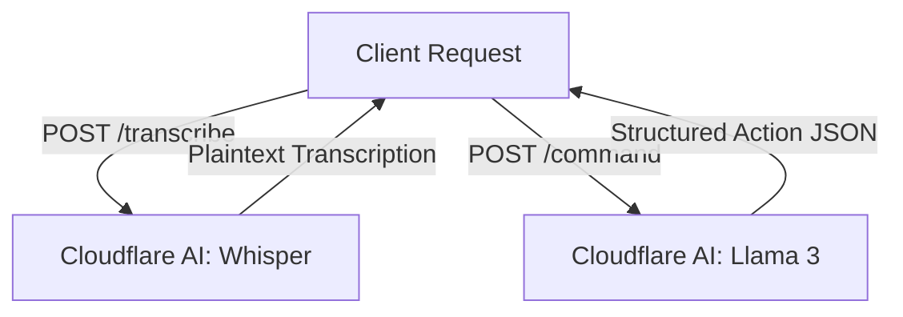

<div align="center">
  
  
  # 🪐 saturday

  [](https://workers.cloudflare.com/)
  [](https://www.typescriptlang.org/)
  [](https://llama.meta.com/)
  [](https://openai.com/research/whisper)

  **saturday** is a highly efficient, serverless AI copilot backend powered by Cloudflare Workers and Cloudflare AI. It enables seamless audio transcription and intelligent natural language command parsing into structured actions.
</div>

---

## ⚡ Features

- 🎙️ **Audio Transcription**: Process raw audio streams using the state-of-the-art OpenAI Whisper model (`@cf/openai/whisper`).
- 🤖 **Structured Command Parsing**: Parse human language inputs into structured, actionable JSON payloads with Meta Llama 3 (`@cf/meta/llama-3-8b-instruct`).
- ☁️ **Edge-native Speed**: Built directly on Cloudflare Workers for ultra-low latency execution and zero cold starts.
- 🛠️ **Configurable Actions**: Preconfigured action taxonomy including tab manipulation, web searches, context explanation, and general knowledge.

---

## 🏗️ Architecture

`saturday` leverages the power of Cloudflare's edge network and serverless GPU execution. It maps incoming requests to specialized AI pipelines:



---

## 🚀 API Endpoints

### 1. `POST /transcribe`
Transcribes raw binary audio data into text.

#### Request Headers
`Content-Type: application/octet-stream` (or standard audio format mime types)

#### Request Body
Raw audio binary blob.

#### Response (`application/json`)
```json
{
  "text": "Hello, how can I help you today?"
}
```

---

### 2. `POST /command`
Parses a natural language instruction and optional context into a structured JSON execution action.

#### Request Body (`application/json`)
```json
{
  "command": "Search for the latest space exploration news",
  "context": "User is currently reading a wiki page about Mars."
}
```

#### Response (`application/json`)
```json
{
  "action": "search_google",
  "query": "latest space exploration news",
  "reasoning": "The user requested space exploration news."
}
```

> [!NOTE]
> The assistant always responds with a valid JSON structure representing one of the pre-defined actions:
> `open_tab`, `search_google`, `download_file`, `copy_text`, `type_text`, `read_page_content`, `find_keyword_on_page`, `get_weather`, `get_time`, `add_todo`, `get_tasks`, `explain_page`, `answer_general`.

---

## ⚙️ Configuration & Deployment

### Prerequisites
- Node.js & npm installed
- [Wrangler CLI](https://developers.cloudflare.com/workers/wrangler/install-and-update/) authenticated

### Local Development
To run a local development server with proxying to Cloudflare's AI network:
```bash
npx wrangler dev
```

### Production Deployment
To deploy the Worker directly to your Cloudflare account:
```bash
npx wrangler deploy
```

---

## 🛠️ Tech Stack & Dependencies

- **Platform**: [Cloudflare Workers](https://workers.cloudflare.com/)
- **Runtime**: V8 Serverless
- **AI Models**: 
  - Audio-to-Text: OpenAI Whisper (`@cf/openai/whisper`)
  - LLM: Meta Llama 3 8B Instruct (`@cf/meta/llama-3-8b-instruct`)
- **Language**: TypeScript
