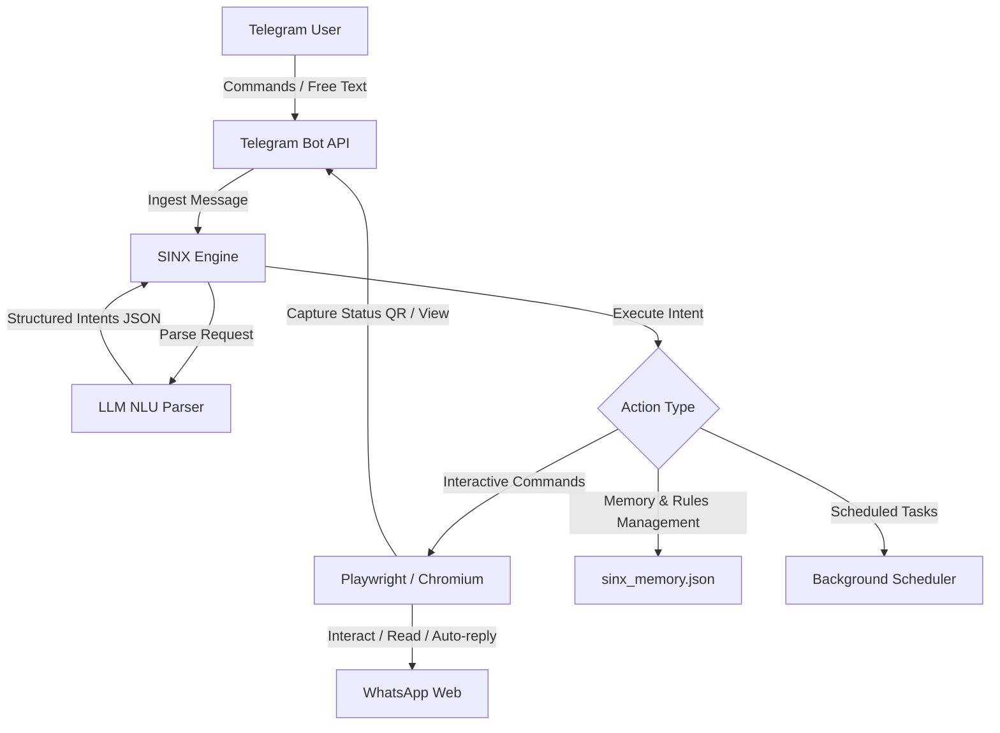

# 🌌 SINX v2 — WhatsApp AI Assistant

<p align="center">
  
  
  
  
</p>

---

### *“Cukup chat biasa — SINX yang pahami dan eksekusi.”*

**SINX v2** is a next-generation WhatsApp automation agent that integrates seamlessly with LLMs (Gemini, Groq, OpenRouter) and is managed entirely through a Telegram Bot. By utilizing natural language processing, you can control WhatsApp activities (sending messages, managing auto-replies, scheduling recurring actions, storing facts) using conversational Indonesian commands.

No complex dashboard needed. Simply talk to your SINX Telegram bot, and let the AI do the heavy lifting.

---

## ⚡ Key Features

*   🧠 **Conversational NLU**: Chat with your bot in natural Indonesian. The underlying AI automatically extracts and executes structured intents (e.g., `"chat syafiq bilang halo"`, `"ingat mama ulang tahun tanggal 5"`).
*   🎭 **Persona Engine**: Teach SINX custom personalities. Assign different voices to different contacts, groups, or keywords.
*   📋 **Smart Rules**: Create auto-reply filters based on:
    *   **Contact/Group**: Specific personas for specific people or group chats.
    *   **Keywords**: Trigger targeted AI replies when specific words are mentioned.
    *   **Time-based**: Set up auto-responders during sleeping hours or off-work times.
*   ⏱️ **Task Scheduler**: Schedule periodic messages to any contact at custom intervals.
*   🖼️ **Context-Aware Media Handling**: Recognizes incoming stickers, GIFs, images, audio, documents, and reaction emojis, allowing the AI to reply appropriately.
*   🚀 **Startup Automations**: Automatically run actions or initialize auto-reply listeners the moment SINX is launched.
*   📱 **Remote Telegram Command Center**:
    *   `login` — Receive and scan the WhatsApp Web QR code as an image directly in chat.
    *   `screenshot` — Inspect current browser status at any time.
    *   `status` & `memory` — Keep track of active rules, personas, schedules, and remembered facts.
    *   `log` — Fetch and monitor system execution logs in real-time.
*   🛡️ **Modern Playwright Backend**: Uses modern Chromium automation instead of unstable legacy ChromeDrivers.

---

## 🛠️ Architecture Flow



---

## 🚀 Quick Start

### 1. Prerequisites
Ensure you have Python 3.8+ installed on your system.

### 2. Installation
Run the setup batch file or install dependencies manually:

```bash
# Clone the repository
git clone https://github.com/alchemist4real/sinxv.git
cd sinxv

# Run setup helper
sinx_setup.bat
```

*Or install manually:*
```bash
pip install requests python-dotenv pyperclip playwright thefuzz
python -m playwright install chromium
```

### 3. Environment Configuration
Create a `.env` file in the root directory (SINX will auto-generate one on the first run if it doesn't exist) and populate it with your API keys:

```ini
TELEGRAM_TOKEN=your_telegram_bot_token
CHAT_ID=your_telegram_chat_id
GEMINI_API_KEY=your_gemini_api_key
GROQ_API_KEY=your_groq_api_key
OPENROUTER_API_KEY=your_openrouter_api_key
PREFERRED_PROVIDER=auto
```

> [!NOTE]
> At least one LLM API key (Gemini, Groq, or OpenRouter) is required.
> Your `CHAT_ID` acts as a security lock. SINX will only respond to messages originating from this Telegram Chat ID.

### 4. Running the Assistant
```bash
python sinx.py
```

---

## 💬 Controlling SINX

Once SINX is running, open your Telegram Bot and type your instructions. You can use standard natural language or use direct command shortcuts.

### 💡 Conversational Examples (Indonesian NLU)
*   **Direct Message**: `chat syafiq bilang saya otw`
*   **Persona Creation**: `buat persona lilo: karakter jail yang suka bercanda`
*   **Auto-Reply Rule**: `balas syafiq pakai persona lilo`
*   **Keyword Trigger**: `kalo ada chat mengandung 'urgent', balas pakai persona emergency`
*   **Message Scheduler**: `ganggu andi setiap 10 menit kirim ping`
*   **Fact Memory**: `ingat bahwa nomor mama adalah 0812345`
*   **Startup Task**: `setiap sinx nyala, kabari syafiq bahwa lilo sudah aktif`

### 🔧 Direct Shortcuts
*   `login` — Initializes the WhatsApp Web login process and sends the QR code to scan.
*   `status` — Displays the connection status, active rules, and schedule counts.
*   `memory` — Shows all remembered facts, rules, contacts, and personas.
*   `aktifkan` / `nonaktifkan` — Toggles the WhatsApp message listener (auto-reply engine).
*   `screenshot` — Takes a live screenshot of the WhatsApp Web page.
*   `log` — Outputs the last 20 lines of application logs.
*   `bantuan` — Lists available commands.

---

## ⚙️ How It Works under the Hood

1.  **Playwright Automation**: On startup, SINX initializes a persistent user profile in `sinx_profile/`, keeping you logged into WhatsApp Web even after application restarts.
2.  **Telemetry Dispatch**: A polling thread fetches incoming Telegram messages. If the message matches a direct shortcut (e.g., `login`), it runs the operation immediately.
3.  **LLM Intent Classification**: For conversational commands, SINX packages your request along with a context summary of your current contacts, personas, and memory. The LLM parses it into structured intents.
4.  **Pending Actions Confirmation**: For complex or potentially destructive commands (e.g., creating tasks, rules, or remembering facts), SINX presents a natural-language summary and asks you to confirm (`ya`/`tidak`) before executing.
5.  **Autonomous Polling**: When auto-reply is active, SINX regularly scans the WhatsApp interface for unread messages. It intercepts new messages, analyzes the message type (including media flags), formats a conversational prompt for the LLMs with recent context, and sends a typed-like reply back.

---

## 🔮 Tech Stack

*   **Runtime**: [Python 3](https://www.python.org/)
*   **Automation**: [Playwright Python](https://playwright.dev/python/)
*   **NLU / Generation**: [Google Gemini API](https://ai.google.dev/), [Groq Llama-3](https://groq.com/), [OpenRouter API](https://openrouter.ai/)
*   **Libraries**: `requests`, `python-dotenv`, `pyperclip`, `thefuzz` (for smart contact resolution)

---
<p align="center">
  Made with 🌌 by alchemist4real
</p>
