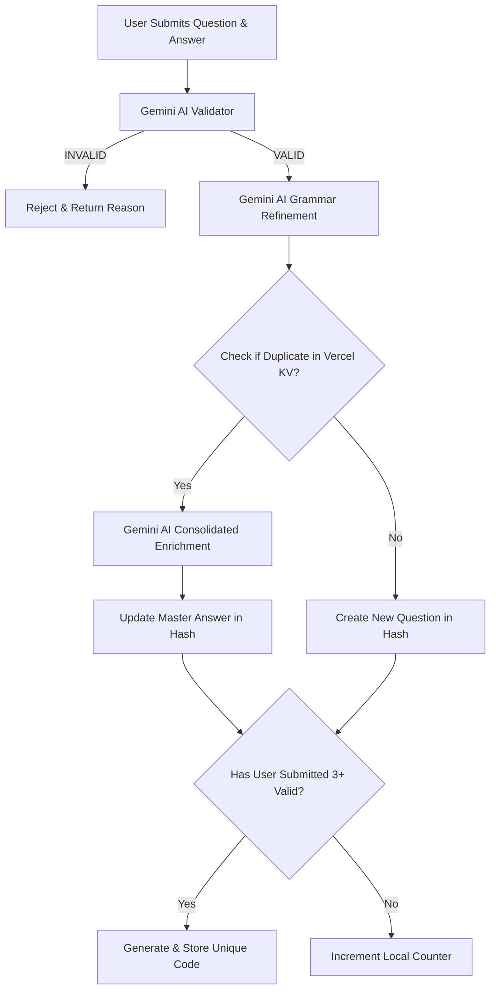

<div align="center">

# 🔮 soexsoex

[](https://ai.google.dev/)
[-black?style=for-the-badge&logo=redis&logoColor=red)](https://vercel.com/docs/storage/vercel-kv)
[](https://tailwindcss.com/)
[](https://vercel.com/)

**an ai-powered collaborative question bank utilizing gemini content validation, grammar refinement, and vercel kv answer consolidation.**

---
[✨ Key Features](#-key-features) • [⚡ Workflow](#-workflow-architecture) • [🛠️ Tech Stack](#-tech-stack) • [📂 Project Structure](#-project-structure) • [⚙️ Setup & Deployment](#%EF%B8%8F-setup--deployment)
</div>

## 🌌 Overview

**soexsoex** is a smart, gamified repository for competitive olympiad/academic questions (e.g., Mathematics, Physics, KSN-K). It introduces a barrier-to-entry mechanics where users must contribute **3 verified and valid questions** before unlocking dashboard access. Under the hood, it rotates API keys to harness the reasoning capabilities of the Google Gemini API for validation, formatting corrections, and dynamic duplicate merging.

---

## ✨ Key Features

*   **🛡️ Double AI-Check**: Every submission is processed via Gemini to ensure the question is valid and the answer makes sense, filtering out low-quality/troll submissions automatically.
*   **✍️ PUEBI Polish**: Automatic spelling, grammar, and typography adjustments based on Indonesian standard conventions (PUEBI/PUEYD).
*   **🧬 Dynamic Answer Enrichment**: When a duplicate question is detected, rather than rejecting it, the engine passes the existing answer and the new contribution to Gemini, creating a combined, comprehensive **Master Answer**.
*   **🔒 Gamified Access Control**: Generates an 8-character unique entry token after 3 valid submissions. Authentication bypass is available for administrators using a secret override code.
*   **⚡ Modern Dark Interface**: Sleek Tailwind CSS interface optimized for low light, featuring tabs, real-time message boxes, and client-side searching.

---

## ⚡ Workflow Architecture



---

## 🛠️ Tech Stack

-   **Frontend**: HTML5, Vanilla JavaScript, Tailwind CSS (CDN), Inter Font.
-   **Backend**: Vercel Serverless Functions (Node.js).
-   **Database**: Vercel KV (Key-Value Redis instance) storing hashes for question indexes, question details, and unique login codes.
-   **AI Integration**: `gemini-2.5-flash-preview-09-2025` using an API rotation pool to distribute loads across multiple keys.

---

## 📂 Project Structure

```bash
├── api/
│   ├── get-questions.js     # Fetches master question/answer catalogs from Vercel KV
│   ├── login.js             # Validates entry tokens against the KV whitelist (includes bypass)
│   └── submit-question.js   # Contains validation, refinement, index checks, & enrichment logic
├── index.html               # Main frontend portal containing Login, Input, and Dashboard views
└── package.json             # Node.js dependencies (@vercel/kv, uuid)
```

---

## ⚙️ Setup & Deployment

### 1. Prerequisites
- A [Vercel](https://vercel.com/) account.
- One or more Google Gemini API keys.

### 2. Configure Vercel KV
Connect a **Vercel KV** database to your project via the Vercel Dashboard. This will automatically inject the required environment variables:
- `KV_REST_API_URL`
- `KV_REST_API_TOKEN`

### 3. Environment Variables
Add the following key to your project's Environment Variables:
```env
GEMINI_API_KEY_POOL=key1,key2,key3
```
*(Split by commas, the serverless handler will automatically rotate between them randomly.)*

### 4. Special Codes
- Users receive a random 8-character code (e.g. `B9D8A2C1`).
- The admin override code is `truegoddess`.
